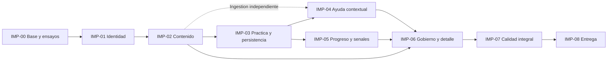

# Plan progresivo de implementación de Alunza

**Preparado el 10/09/2026.** El estado inicial era documental. Los cortes de IMP-00 y la implementación institucional [IMP-01](../work/IMP-01-identity.md) registran por separado código, pruebas locales y dependencias remotas. Los incrementos siguientes continúan planificados; este índice no acredita aceptación académica ni autoriza ampliar el encargo vigente.

El objetivo es desarrollar Alunza por incrementos que podamos ejecutar, revisar y conservar antes de ampliar el producto. El [plan resumido del agente](../agent/01-plan-de-implementacion.md) mantiene los identificadores `IMP-00` a `IMP-08`; esta carpeta los descompone en trabajo concreto.

## Orden recomendado

Construir primero una base ejecutable; después identidad y aislamiento; luego el contenido que resolverá el estudiante; a continuación el circuito determinista de práctica y persistencia. Sobre esa evidencia se construyen dos capacidades independientes: ayuda contextual y seguimiento. Finalmente se completa el gobierno, se valida el conjunto y se prepara la entrega.

La seguridad, las pruebas, la accesibilidad, la auditoría y la preparación de despliegue empiezan con el componente que las necesita. Las fases finales consolidan y verifican el conjunto; no son el primer momento para atender esos aspectos.

| Fase y plan detallado | Resultado que podremos usar o demostrar | Dependencia principal | Incrementos |
| --- | --- | --- | --- |
| [IMP-00 Base técnica](00-fundacion.md) | Web/API/datos reales arrancan, primer acceso protegido, CI inicial y ensayos de viabilidad | Specs y entorno local | 8 |
| [IMP-01 Identidad y aislamiento](01-identidad-y-aislamiento.md) | Acceso por rol, organizaciones y usuarios con permisos efectivos | Base de IMP-00; DEC-001 para aprovisionamiento | 8 |
| [IMP-02 Contenido y publicación](02-contenido-y-publicacion.md) | Profesor prepara/publica; estudiante se incorpora y abre ejercicio con editor | Identidad y ámbito de IMP-01 | 8 |
| [IMP-03 Práctica y ejecución](03-practica-y-ejecucion.md) | Ejecutar, enviar, persistir, diagnosticar, reintentar y ver avance mínimo real | Contenido/versiones; ensayo del ejecutor | 8 |
| [IMP-04 Ayuda contextual](04-ayuda-contextual.md) | Material autorizado, citas, pistas/feedback y degradación controlada | Ingestión: IMP-02; ayuda de intento: IMP-03 | 8 |
| [IMP-05 Progreso y señales](05-progreso-y-senales.md) | Progreso explicable, tres señales y tablero docente | Intentos/eventos de IMP-03; no depende de IA para calcular | 8 |
| [IMP-06 Gobierno y seguimiento](06-gobierno-y-seguimiento.md) | Detalle estudiantil, revisión de señales, banco, auditoría y CSV completos | IMP-02/03/05; ayudas de IMP-04 para detalle integral | 7 |
| [IMP-07 Calidad integral](07-calidad-integral.md) | Cobertura funcional/no funcional comprobada sobre un candidato integrado | Funcionalidad integrada y ambientes de prueba | 8 |
| [IMP-08 Entrega y operación](08-entrega-y-operacion.md) | Demo reproducible, manuales, release y recuperación verificadas | Candidato de IMP-07 y condiciones del ambiente acordado | 8 |

El desglose contiene **71 incrementos planificados**, no 71 sesiones ni 71 historias nuevas. Conserva los **27 RF Must, 108 escenarios, 29 RNF y 6 ORG** originales. La [matriz de control](09-control-y-trazabilidad.md) indica dónde se construye y se cierra cada resultado.

Las flechas indican dependencias funcionales, no una prohibición de preparar trabajo temprano. La infraestructura, las pruebas y la documentación acompañan todas las fases. Los ensayos productivos de Sandbox y Azure OpenAI empiezan en IMP-00 si existen acceso y autorización, y se repiten sobre el flujo real en sus fases de integración.

## Cómo avanzaremos poco a poco

1. **Elegir un incremento o un grupo pequeño de una fase.** Definir resultado observable y leer las guías enlazadas. Una tabla extensa no obliga a implementar toda la fase en una sola sesión.
2. **Preparar aceptación y contratos.** Identificar RF/HU/CU/PT, escenarios E1–E4, ámbito, datos ficticios y decisiones relevantes antes de escribir código.
3. **Implementar las capas necesarias.** Datos, API, UI y pruebas crecen juntas cuando el resultado las requiere. Un incremento de infraestructura puede ser técnico; un flujo funcional necesita su recorrido completo.
4. **Ejecutar y demostrar.** Entregar comandos reales, pruebas pertinentes, estado por ambiente, una demo breve y decisiones pendientes. Corregir lo necesario dentro del alcance encargado.
5. **Registrar y cerrar el alcance.** Actualizar el estado del incremento y la próxima acción. Al terminar una fase encargada, no iniciar otras por inercia. Una solicitud posterior de todo el MVP sí autorizaría recorrer las fases necesarias.

En cada cierre revisamos qué puede hacer ahora cada rol, qué se comprobó, qué sigue parcial y qué capacidad conviene construir después. No se necesita aprobación por cada detalle técnico reversible; las decisiones de permisos, semántica pedagógica o efectos externos se tratan conforme a la autorización real y la [guía de decisiones](../agent/12-decisiones-pendientes.md).

## Primer trabajo recomendado

Comenzar por **IMP-00.01 a IMP-00.04**: inspección y versiones, workspace, Supabase local, conexión real y ruta protegida. El resultado será una base pequeña que ya podamos ejecutar y sobre la que probar cada cambio posterior.

Seguir con CI/smoke (**IMP-00.05**) y los ensayos controlados (**IMP-00.06 a IMP-00.08**). Mantener estos ensayos tempranos evita construir muchas pantallas sobre un ejecutor, credenciales o compatibilidad todavía no demostrados. Si un recurso remoto no está disponible, registrar esa brecha y continuar la parte local independiente; no cerrarlo como integrado.

El [archivo de la primera fase](00-fundacion.md) incluye un prompt listo para encargar ese primer grupo. Cada una de las demás fases también incluye su propio encargo acotado.

## Qué puede adelantarse o desarrollarse en paralelo

| Tras disponer de… | Trabajo que se puede adelantar | Contrato que debemos preservar |
| --- | --- | --- |
| DTO y estados iniciales de IMP-00/01 | Componentes visuales y pantallas de sesión, mientras se implementa autorización | Los mocks solo ayudan al desarrollo; la aceptación conecta API y datos reales |
| Identidad y contratos de clase de IMP-01/02 | Adaptador Docker y pruebas del supervisor de IMP-03 | Los fixtures del ejecutor no conceden acceso a ejercicios aún inexistentes ni cierran RF |
| Fuentes y permisos de IMP-02 | Ingestión de IMP-04, aunque el envío todavía no esté terminado | Ingestión autorizada independiente; la ayuda sobre un intento espera persistencia |
| Intentos/eventos/versiones de IMP-03 | IMP-04 e IMP-05 como ramas independientes | El LLM no calcula progreso ni señales; eventos de ayuda se integran después sin inventar historia |
| Banco versionado y auditoría ya capturada | Partes de gobierno/visor de IMP-06 | El detalle completo y la revisión necesitan la evidencia de las ramas anteriores |
| Un nuevo componente funcional | Accesibilidad, negativas, rendimiento inicial y manual de ese flujo | IMP-07 revalida el candidato integrado; las pruebas tempranas no se posponen |

Con un solo frente de desarrollo, seguir el orden de la tabla de fases. Si IA queda esperando configuración externa, avanzar IMP-05 y las partes independientes de IMP-06. Con varios agentes, asignar componentes o archivos disjuntos y acordar DTO/migraciones antes; el integrador revisa coherencia, permisos y pruebas. La colaboración de agentes no añade agentes al producto ni acredita participación humana de CAPSTONE.

## Hitos de producto y cierre

| Hito propuesto | Momento | Evidencia observable |
| --- | --- | --- |
| Base de trabajo | IMP-00 | Arranque reproducible y ruta técnica real |
| Institución y contenido utilizables | IMP-02, con IMP-01 completo | Administrador prepara usuarios; profesor publica; alumno accede a su ejercicio |
| Primer circuito técnico completo | IMP-03 | Publicar→ejecutar→enviar→guardar→diagnosticar→reintentar, con aislamiento |
| Tutor formativo y seguimiento | IMP-04/05 | Ayuda sustentada o fallback, progreso y señales independientes del LLM |
| Funcionalidad completa del MVP | IMP-06, con cierres previos verificados | Los 27 RF están integrados; aún corresponde validar calidad y aceptación |
| Candidato verificado | IMP-07 | Matriz de pruebas, riesgos residuales y objetivos medidos con perfil |
| Entrega reproducible | IMP-08 | Demo, manuales, versión, despliegue y recuperación con evidencia |

Estos hitos técnicos no reemplazan los sprints ni las fechas académicas. Se conserva el [roadmap original](../../specs/12-plan-de-entrega.md), incluidos sus pendientes de capacidad y freeze DEC-011. No se asignan nuevas fechas ni se convierten 184 puntos o 540 horas documentales en avance real.

## Estimación y control de cambios

Planificar solo el siguiente grupo de incrementos con la disponibilidad real del equipo. Después de los primeros cierres, estimar el trabajo restante usando esfuerzo observado, riesgos y dependencias. Evitar prometer un número de días antes de conocer el estado del entorno y de los proveedores.

Si una unidad es demasiado grande, dividirla en resultados comprobables conservando su ID padre y aceptación. Si aparece trabajo necesario, añadir una subtarea con motivo y trazabilidad; no agregar nuevos RF ni retirar Must para cuadrar capacidad. Un bloqueo se registra con acción concreta, responsable de resolverlo y qué puede continuar.

Todas las fases comienzan **pendientes**. Usar los estados y el registro de [control y trazabilidad](09-control-y-trazabilidad.md); no marcar casillas por redactar archivos, instalar skills o generar código sin probarlo.

## Lecturas de apoyo

- [AGENTS.md](../../AGENTS.md): forma de trabajo y límites del proyecto.
- [Specs e inventario](../../README.md): autoridad y requisitos.
- [Guías del agente](../agent/README.md): instrucciones técnicas por área.
- [Skills instaladas y recomendadas](../agent/15-skills-recomendadas.md): cargar solo las que correspondan.
- [Control y trazabilidad](09-control-y-trazabilidad.md): RF, decisiones, entrega y registro de estado.
