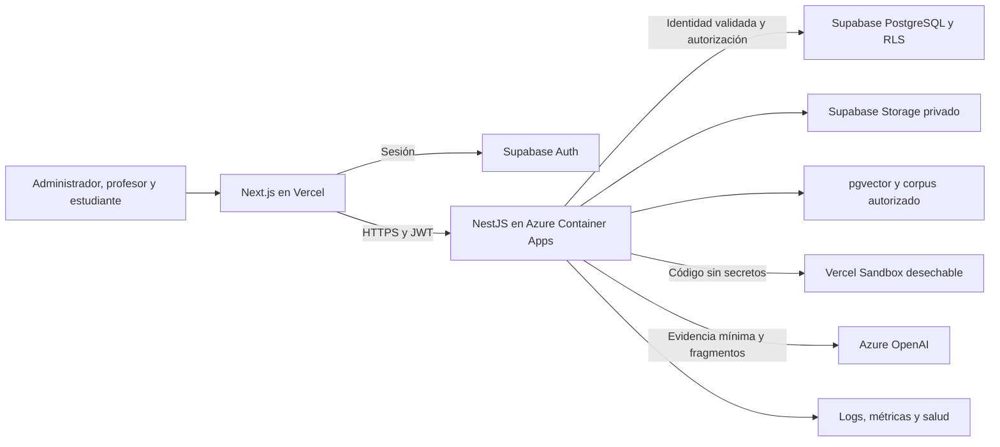

# Arquitectura de Alunza

Estado: componentes y tecnologías **Documentados** en F01 §§2.1, 2.4 y 5.8; distribución modular y protocolos internos **Propuesta técnica**. Fuente: [ERS 1.3](<../Evidencias CAPSTONE/Fase 1/Evidencias de proyecto/Informe_ERS_Alunza.docx>). Fecha: 2026-09-10. No existe implementación acreditada.

## Decisiones que gobiernan el diseño

AD-ARQ-001 fija la arquitectura híbrida. Next.js presenta la experiencia web; NestJS concentra dominio, autorización, auditoría y orquestación. Supabase aporta identidad, persistencia, archivos e índice vectorial. Vercel Sandbox ejecuta código estudiantil en producción y Docker lo hace localmente. AD-IA-001 fija Azure OpenAI como proveedor inicial configurable.



Los diagramas representan responsabilidades previstas. La aplicación web no contiene una API de negocio paralela y el navegador no accede directamente a resultados internos, auditoría completa, reglas de escritura o pruebas ocultas.

## Stack y compatibilidad

| Capa | Línea base documental | Decisión pendiente de implementación |
| --- | --- | --- |
| Web | Next.js App Router, React 19, TypeScript 5.x | Fijar versión exacta de Next.js y patches compatibles |
| Interfaz | Tailwind CSS, shadcn/ui, Recharts, Zod | Fijar versiones y biblioteca de editor; no añadirla como requisito ya aprobado |
| API | Node.js 24 LTS, NestJS 12 | Fijar patch y configuración de módulos/compilación |
| Datos | Supabase PostgreSQL con compatibilidad objetivo 17, RLS y pgvector | Registrar versión real del servicio y extensiones |
| Identidad/archivos | Supabase Auth y Storage | Métodos de sesión, entrega de invitaciones y políticas de buckets |
| Ejecución | Vercel Sandbox productivo, adaptador Docker local | Probar supervisor y restricciones internas |
| IA | Azure OpenAI mediante adaptador | Deployment/modelo, embeddings, dimensión y versión de API |
| Calidad | Jest, Cypress y GitHub Actions | Configuración reproducible compatible con ESM y Node 24 |
| Local | Docker Compose y Supabase CLI | Versiones fijadas y scripts de inicio/seed |

La [guía actual de NestJS](https://docs.nestjs.com/migration-guide) exige revisar ESM y establece Node 24.15+ para sus generadores en la familia 24. **Propuesta:** fijar un patch soportado que satisfaga ese mínimo y verificar Jest explícitamente; no adoptar cambios de herramientas del generador sin actualizar la línea base. El lockfile y CI demostrarán compatibilidad, pendiente DEC-007.

## Módulos del backend

**Propuesta técnica:** monolito modular NestJS. Evita distribuir la lógica en microservicios para este MVP y permite separar posteriormente un trabajador sin alterar los contratos.

| Módulo | Responsabilidad | Dependencias de dominio |
| --- | --- | --- |
| IdentityAccess | JWT validado, estado vigente, roles y pertenencia | Organizaciones y membresías |
| Organizations | Organización, usuarios e invitaciones de su ámbito | IdentityAccess, Audit |
| Academic | Cursos, clases, asignaciones y códigos de incorporación | Organizations |
| Content | Conceptos, versiones de ejercicios y pruebas | Academic |
| Activities | Orden de ejercicios y DRAFT/PUBLISHED/CLOSED | Content, Academic |
| Practice | Ejecuciones, intentos y resultados deterministas | Activities, ExecutionPort |
| Materials | Fuentes y versiones, ingestión y búsqueda filtrada | Academic, StoragePort, EmbeddingPort |
| Feedback | Pistas y explicaciones asociadas a intentos persistidos | Practice, Materials, GenerationPort |
| Progress | Agregados reconstruibles desde intentos | Practice, Activities, Content |
| Signals | Reglas versionadas, evaluación y revisión | Progress, eventos elegibles |
| Audit | Eventos administrativos y exportaciones | Contexto autorizado; no llama a módulos de negocio |
| Operations | Salud, trabajos pendientes, mediciones y fallas | Adaptadores de infraestructura |

Los módulos de progreso y señales no dependen del proveedor de IA. Un servicio de aplicación invoca puertos de infraestructura; el dominio no importa SDKs de Vercel, Azure o Supabase. Los esquemas compartidos deben contener contratos públicos, nunca secretos ni test cases ocultos.

## Fronteras de confianza

1. **Navegador a API:** JWT verificado y autorización actual para cada operación. IDs, rol, diagnóstico y completitud recibidos del cliente no son evidencia confiable.
2. **API a datos:** rol de aplicación propio sin BYPASSRLS y contexto actor/organización por transacción, establecido solo tras verificar JWT. El CRUD de dominio no se expone directamente al navegador. Las operaciones privilegiadas de Auth o mantenimiento tienen adaptadores separados. `service_role` no sirve como acceso general de cada request.
3. **API a ejecutor:** código estudiantil no confiable; supervisor fuera de su control. Los resultados deben proceder del arnés y no de una cadena JSON que el alumno pueda imprimir.
4. **API a IA:** documentos y código se tratan como contenido no confiable. El modelo no recibe herramientas para mutar datos ni ejecutar acciones de dominio.
5. **Operación:** secretos solo en servicios autorizados; ambientes y datos separados; logs sin cargas sensibles.

La defensa incluye políticas por operación, grants mínimos y vistas protegidas. La [documentación de RLS](https://supabase.com/docs/guides/database/postgres/row-level-security) advierte que las vistas pueden omitir RLS y que `service_role` la evita. Ver [seguridad](09-seguridad-y-privacidad.md) para el diseño aplicable.

## Secuencia de envío y ayuda

```mermaid
sequenceDiagram
    participant W as Web
    participant B as NestJS
    participant X as Ejecutor
    participant D as PostgreSQL
    participant I as RAG e IA
    W->>B: Enviar código, versión e idempotencia
    B->>B: Validar identidad, clase y publicación
    B->>X: Ejecutar verificaciones requeridas
    X-->>B: Evidencia técnica normalizada
    B->>D: Transacción intento, resultado y eventos
    alt Falla de persistencia
        D-->>B: Error
        B-->>W: No confirmado; conservar editor
    else Persistencia confirmada
        D-->>B: Intento confirmado
        B-->>W: Intento y resultado técnico
        W->>B: Solicitar feedback del intento
        B->>I: Recuperar fuentes y generar salida
        I-->>B: Salida validable o falla controlada
        B->>D: Persistir feedback validado
        B-->>W: Ayuda o estado de degradación
    end
```

El feedback es una solicitud separada; se puede iniciar desde la interfaz tras la confirmación. La persistencia del intento antecede tanto a la recuperación RAG como a la llamada del modelo. No se mantiene una transacción de BD abierta mientras se espera a proveedores externos.

**Propuesta:** cerrar la actividad bloquea solicitudes admitidas después de ese cierre. Una ejecución ya admitida puede confirmar su intento asociado a la versión y hora de admisión. La transacción serializa admisión/cierre y permite demostrar el orden. Confirmar esta política con DEC-002 antes de RF-005/010.

## Trabajos durables y concurrencia

**Propuesta DEC-004:** ingestión documental y feedback usan registros durables de trabajo en PostgreSQL, con estados `QUEUED`, `RUNNING`, `SUCCEEDED`, `FAILED`. Estos son estados operativos nuevos y no reemplazan los catálogos del producto.

El trabajador reclama cada trabajo con exclusión transaccional, lease y vencimiento; confirma resultado y finalización juntos. Una caída permite reclamarlo de nuevo, con clave de deduplicación y número máximo de intentos. Revalidar permisos y versión de fuente al ejecutar y antes de publicar. Cancelar un trabajo no concede acceso a su resultado. No asumir que una promesa en memoria o un evento local sobrevivirá a un reinicio o al escalado de Azure.

El cron de señales necesita exclusión entre réplicas. Los agregados pueden calcularse en consulta para la demo, con índices; cualquier caché debe incorporar organización, clase, filtros y versión. Las respuestas personales no se comparten por caché de CDN.

## Estructura propuesta del repositorio de implementación

```text
apps/web/                 Next.js y componentes por rol
apps/api/                 Módulos NestJS y trabajador interno
packages/contracts/       DTO públicos y esquemas de validación
packages/domain/          Reglas puras de progreso y señales
packages/runner/          Supervisor, protocolo y adaptadores
supabase/migrations/      Modelo, permisos, RLS e índices
supabase/tests/           Pruebas de aislamiento
fixtures/demo/            Datos ficticios y corpus autorizado
tests/integration/        Flujo entre servicios y fallas
tests/e2e/                Recorridos Cypress
infra/                    Compose y configuración de despliegue
specs/                    Estas especificaciones
```

Esta estructura no existe todavía. El gestor de paquetes y la estrategia del workspace deben elegirse en DEC-007; no se exige un orquestador de monorepo adicional.

## Criterios de aceptación arquitectónica

- Las llamadas de negocio de los tres roles llegan a NestJS y aplican la misma autorización.
- Una falla de IA no cambia resultado, progreso o señales y no pierde el intento.
- Ambos adaptadores del ejecutor satisfacen [el mismo contrato](13-ejecucion-controlada.md); el local no acredita seguridad del productivo.
- Los trabajos interrumpidos se recuperan sin duplicar intentos, feedback aceptado ni señales.
- Pruebas directas de API, BD y Storage rechazan cruces de organización/clase y estados deshabilitados.
- Se puede reconstruir la demo y ejecutar el flujo desde un ambiente limpio con la guía operativa.

Las metas de tiempo se evalúan de extremo a extremo conforme a [calidad](10-calidad-y-pruebas.md); la arquitectura seleccionada no demuestra por sí misma su cumplimiento.
