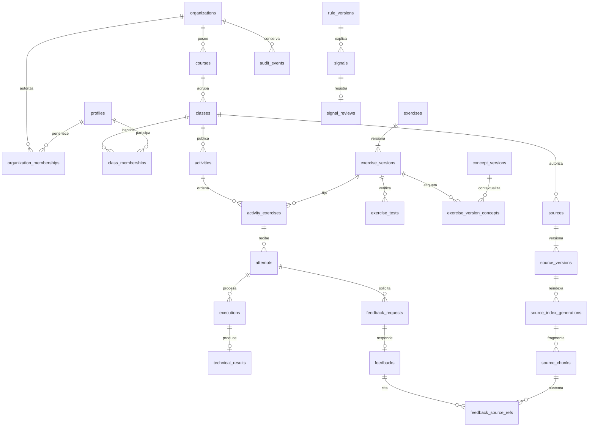

# 06 · Modelo de datos

**Estado:** especificación contrastada con la ERS 1.3 del 04/09/2026. Identidad institucional concretada en IMP-01 mediante migración incremental y [diccionario revisado](../docs/work/IMP-01-dictionary.md). El contrato ejecutable de envíos, historial y avance de IMP-03.04–03.06 se distingue del modelo lógico propuesto en §4.3.1, con persistencia verificada en TEST mediante SQL y HTTP. Materiales, ayuda y ledger de IMP-04.01–04.07, junto con la preparación ejecutable de IMP-04.08, están implementados y probados en TEST; §4.4 y sus diccionarios detallan el contrato. Las entidades futuras conservan su carácter de propuesta. La evidencia local no acredita despliegue remoto ni aceptación completa de IMP-04.08.

**Documentado** identifica una obligación de las fuentes. **Propuesta** identifica cómo materializarla. **Pendiente** identifica una decisión que debe resolverse antes del hito indicado. Salvo las reglas expresamente marcadas como documentadas, los nombres físicos, tipos, tablas, índices y transacciones de este documento son propuestas.

## 1. Fuentes, alcance y precedencia

Fuentes principales:

- [ERS, §§2.1, 2.4, 3.1.5, 3.2 y 3.3](<../Evidencias CAPSTONE/Fase 1/Evidencias de proyecto/Informe_ERS_Alunza.docx>).
- [Casos de uso extendidos, reglas del MVP y ALZ-CU-001 a ALZ-CU-027](<../Evidencias CAPSTONE/Fase 1/Evidencias de proyecto/Documento_Casos_de_Uso_Extendidos_Alunza.docx>).
- [MER histórico, imagen](<../Evidencias CAPSTONE/Fase 1/Evidencias de proyecto/MER/MERALUNZA.png>) y [descriptor del diseño](<../Evidencias CAPSTONE/Fase 1/Evidencias de proyecto/MER/MER_ALUNZA.dmd>).

**Documentado:** el almacenamiento vigente es Supabase PostgreSQL, con objetivo de compatibilidad PostgreSQL 17, Auth, Storage, RLS y pgvector. NestJS conserva las reglas de negocio y la autorización. El modelo debe soportar organizaciones, cursos, clases, ejercicios, actividades, intentos, progreso, fuentes, reglas, señales y auditoría. El MVP se limita a Programación I con JavaScript.

**Propuesta:** `organization` es el nombre técnico del colegio o institución cliente; `course` describe el curso curricular; `class` identifica el grupo de alumnos y profesores de una organización. Una actividad pertenece a una clase y contiene ejercicios versionados. No confundir curso con clase ni ejercicio con actividad.

Este documento se complementa con [arquitectura](05-arquitectura.md), [API](07-api-y-contratos.md), [IA/RAG](08-ia-y-procesamiento.md), [seguridad](09-seguridad-y-privacidad.md), [ejecución controlada](13-ejecucion-controlada.md) y [progreso y señales](14-progreso-y-senales.md). Las decisiones abiertas se registran en [fuentes y decisiones](00-fuentes-y-decisiones.md).

## 2. Tratamiento del MER existente

La imagen fue inspeccionada visualmente. Contiene `ROL`, `USUARIO`, `INSCRIPCION`, `CURSO`, `UNIDAD`, `CONTENIDO`, `ACTIVIDAD`, `PREGUNTA`, `OPCION_RESPUESTA`, `INTENTO`, `RESPUESTA`, `DESEMPENO`, `INTERACCION_IA` y `RECOMENDACION`. Usa tipos Oracle como `NUMBER`, `VARCHAR2` y `TIMESTAMP WITH LOCAL TIME ZONE`. El `.dmd` disponible es un descriptor de diseño Oracle Data Modeler, sin el diccionario completo de tablas en su contenido visible.

| Elemento del MER | Tratamiento propuesto para la línea base actual |
| --- | --- |
| `USUARIO` con un `ROL` | Identidad administrada por Supabase Auth, perfil y membresías con rol y alcance explícito. |
| `INSCRIPCION` en `CURSO` | Inscripción en `class_memberships`; fecha de inscripción sigue siendo evidencia, pero deja de ser clave primaria. |
| `CURSO → UNIDAD → ACTIVIDAD` | `courses → classes → activities`. No convertir unidades automáticamente en clases: son conceptos distintos y requieren mapeo si llegan a existir datos. |
| `PREGUNTA`, `OPCION_RESPUESTA`, `RESPUESTA` | No son entidades obligatorias del MVP de programación. Se sustituyen funcionalmente por ejercicios JavaScript, pruebas y resultados técnicos; no se añade un módulo de cuestionarios. |
| `INTENTO` con puntaje/porcentaje | Historial inmutable de código, versión, eventos y resultado determinista. No trasladar puntajes como calificación ni puntaje de IA. |
| `DESEMPENO` | Proyección explicable de ejercicios completados/requeridos, reconstruible desde evidencias. |
| `CONTENIDO`, `INTERACCION_IA`, `RECOMENDACION` | Fuentes versionadas, fragmentos, solicitudes de feedback, referencias y señales deterministas separadas. |
| Organización, clase, versión, fuente, regla, señal y auditoría | Faltan o no están resueltas en el MER histórico; son necesarias según la ERS vigente. |

**Documentado:** AD-ARQ-001 fija el stack vigente. **Propuesta:** el MER se conserva como antecedente, no como DDL para producción. **Pendiente:** revisar el nuevo modelo lógico con el equipo antes de emitir la primera migración; véase DEC-006. No se modifican ni eliminan los archivos originales.

## 3. Convenciones e invariantes generales

### 3.1 Tipos y nombres

| Convención propuesta | Regla |
| --- | --- |
| Identificadores | `uuid` generado por el servidor; `profiles.id` coincide con `auth.users.id`. No usar correo, fecha o código de incorporación como clave primaria. |
| Nombres | Tablas y columnas en `snake_case`; contratos HTTP en `camelCase`, salvo nombres exactos del contrato RAG documentado. |
| Tiempo | `timestamptz` en UTC; `date` para fechas académicas sin hora. La presentación aplica la zona configurada sin cambiar el orden de eventos. |
| Campos comunes | `id`, `organization_id` en datos institucionales y `created_at`; `updated_at` y `revision` solo en registros editables; `created_by` cuando existe autor humano. |
| Archivo lógico | `archived_at` y `archived_by` en organizaciones y catálogos archivables. No implica borrado de evidencia. |
| Cantidades | Enteros no negativos para bytes, tokens, duraciones, contadores y orden. No almacenar porcentajes como única evidencia de progreso. |
| Texto | `text` con límites validados por contrato; no asumir que `text` permite entradas ilimitadas. Los límites sin fuente se configuran y documentan antes de aceptación. |
| JSON | `jsonb` para parámetros versionados, evidencia y métricas con esquema; no para sustituir claves foráneas o permisos consultables. |

En los diccionarios, `?` indica nulabilidad. Las referencias y campos de alcance son obligatorios salvo indicación contraria. Las tablas puente usan las claves indicadas en lugar de un `id` artificial cuando este no aporta identidad de dominio.

### 3.2 Integridad por organización y clase

1. Todo registro de una organización conserva su `organization_id`, incluso cuando puede inferirse mediante otra relación.
2. Las referencias entre entidades institucionales usan claves compuestas `(organization_id, id)` y claves foráneas equivalentes. Un UUID válido de otra organización no debe poder insertarse como referencia.
3. Las entidades de clase conservan `class_id`; las referencias relevantes verifican también `(organization_id, class_id, id)`. Actividad, intento, fuente y señal deben pertenecer a la misma clase declarada.
4. No se aceptan `organization_id`, `student_id`, `created_by`, rol o estado privilegiado enviados por el navegador como prueba de autorización. El servidor deriva el actor y verifica el ámbito.
5. Los índices únicos de negocio se limitan al ámbito institucional. Las claves de identidad externas de Auth se tratan separadamente.
6. Las eliminaciones de catálogos referenciados usan `RESTRICT` o archivado. No propagar un borrado de organización a intentos, fuentes citadas o auditoría mediante cascada.
7. La autorización se vuelve a evaluar al consultar evidencia histórica. Haber tenido acceso en el pasado no concede acceso actual.

## 4. Diccionario lógico propuesto

### 4.1 Identidad, gobierno y estructura académica

| Entidad | Campos específicos | Relaciones y restricciones |
| --- | --- | --- |
| `organizations` | `code`, `name`, `timezone`, `revision`, `archived_at?`, `archived_by?`, `archive_reason?` | Código normalizado único. Creación con permiso técnico de un uso. Archivo conserva al único ADMIN activo para lectura; bloqueado por otros miembros activos, invitaciones y trabajos pendientes. |
| `profiles` | `id`, `display_name`, `email_normalized`, `account_state`, `created_at`, `updated_at` | `id → auth.users`. Estado exacto `INVITED`, `ACTIVE` o `DISABLED`. Sin contraseña, hash de contraseña ni tokens en esta tabla. Propuesta MVP: una identidad por correo normalizado; una identidad existente puede referenciarse mediante una membresía autorizada. |
| `organization_memberships` | `organization_id`, `user_id`, `role`, `state`, `joined_at?`, `disabled_at?`, `revision` | Único `(organization_id, user_id)`. `role`: `ADMIN`, `TEACHER`, `STUDENT` como nombres técnicos propuestos. `state`: `INVITED`, `ACTIVE`, `DISABLED`. Perfil y membresía deben estar activos. |
| `organization_invitations` | `organization_id`, `email_normalized`, `role`, `token_digest?`, `generation`, `revision`, `expires_at`, `accepted_at?`, `accepted_by?`, `revoked_at?`, `invited_by` | Secreto utilizable solo en memoria/correo, digest en BD. Vigencia de 72 horas; reenvío reinicia plazo e invalida generación anterior. Aceptar verifica sesión, destinatario y organización; repetición no reactiva membresías deshabilitadas. |
| `provisioning_grants` | `user_id`, `granted_by`, `reason`, `granted_at`, `expires_at`, `revoked_at?`, `revoked_by?`, `revocation_reason?`, `consumed_at?`, `consumed_organization_id?` | Permiso técnico revocable y consumible una vez. El producto no lo concede. Consumo, organización, primer ADMIN y auditoría en una transacción. |
| `invitation_deliveries` | `organization_id`, `invitation_id`, `requested_by`, `kind`, `state`, `attempt_count`, `available_at`, `lease_until?`, `lease_token?`, `auth_user_id?`, `last_error_code?`, `correlation_id` | Entrega durable con lease; máximo tres intentos automáticos. El ADMIN del último trabajo reautoriza cada generación sin cambiar el emisor histórico. Resultado incierto se reconcilia y rota secreto antes de repetir. |
| `courses` | `code`, `name`, `description?`, `academic_period`, `start_date?`, `end_date?`, `archived_at?` | Código único por organización; período documentado en CU-022 con formato técnico por fijar; fin no anterior al inicio si ambas fechas existen. |
| `classes` | `course_id`, `code`, `name`, `description?`, `start_date?`, `end_date?`, `archived_at?` | Curso de la misma organización. Código único por organización. Las fechas deben ser coherentes con el curso según regla académica validada. |
| `class_memberships` | `organization_id`, `class_id`, `user_id`, `class_role`, `enrolled_at`, `ended_at?` | Único `(organization_id, class_id, user_id)`. Rol de clase propuesto `TEACHER` o `STUDENT`, compatible con la membresía institucional activa. `enrolled_at` se conserva para las reglas de inactividad. |
| `class_join_codes` | `class_id`, `token_digest`, `expires_at`, `revoked_at?`, `max_uses?`, `uses_count`, `created_by` | Código no reversible, revocable y expirable. Incremento de usos e inscripción en una transacción. `max_uses` es configuración propuesta; no constituye un límite documentado. |
| `class_invitations` | `class_id`, `email_normalized`, `token_digest`, `expires_at`, `accepted_at?`, `revoked_at?` | Alternativa de invitación individual. Destinatario y clase verificados; aceptación idempotente. |

**Documentado:** ALZ-RF-001/003/020/021/022 exigen estados, unicidad, aislamiento, inscripción sin duplicados y protección del último administrador. CU-021 precisa que el correo no se duplica dentro de una organización.

**Decisión IMP-01 / DEC-001:** la cuenta Auth y el correo normalizado son globales. Cada membresía tiene exactamente un rol y su propio estado. Los administradores consultan solo la proyección de miembros de su organización; no buscan cuentas globales ni deducen otras pertenencias. Deshabilitar una membresía no modifica Auth ni otras organizaciones. Una cuenta ACTIVE sin membresías puede consultar su situación y consumir únicamente permisos explícitos. Las entidades académicas de esta sección permanecen propuestas para IMP-02.

### 4.2 Taxonomía, banco y actividades

| Entidad | Campos específicos | Relaciones y restricciones |
| --- | --- | --- |
| `concept_tags` | `normalized_name`, `current_version_id`, `archived_at?` | Nombre normalizado único por organización. La identidad permanece aunque cambie su descripción. |
| `concept_versions` | `concept_id`, `version`, `name`, `description?`, `parent_concept_id?`, `created_by` | Único `(organization_id, concept_id, version)`. Inmutable. El grafo vigente no admite autorreferencia ni ciclos. |
| `exercises` | `owner_id`, `current_version_id?`, `visibility`, `archived_at?` | Propietario autorizado de la organización. Valores propuestos de visibilidad: `PRIVATE`, `ORGANIZATION`; ningún valor concede acceso a otra organización ni acceso estudiantil a pruebas ocultas. |
| `exercise_versions` | `exercise_id`, `version`, `title`, `statement`, `starter_code`, `entrypoint`, `language`, `difficulty`, `execution_limits`, `published_at?`, `content_hash` | `language = javascript` en MVP. Versión única por ejercicio. Toda versión publicada o referenciada por una actividad publicada es inmutable. Dificultad y límites cumplen los contratos aprobados. |
| `exercise_version_concepts` | `organization_id`, `exercise_version_id`, `concept_id`, `concept_version_id` | Sin etiquetas duplicadas. Fija la versión conceptual utilizada; la relación entre concepto y versión se valida. |
| `exercise_tests` | `exercise_version_id`, `position`, `visibility`, `required`, `test_definition`, `expected_result?`, `definition_hash` | Pruebas deterministas versionadas. Visibilidad propuesta `VISIBLE` o `HIDDEN`. Definición y expectativas ocultas viven en un esquema privado, fuera de la proyección estudiantil. |
| `activities` | `class_id`, `title`, `description?`, `type`, `state`, `opens_at?`, `closes_at?`, `published_at?`, `closed_at?`, `revision` | Tipo técnico propuesto `DIAGNOSTIC` o `FORMATIVE`; corresponde a actividad diagnóstica o formativa documentada en CU-005. Estados documentados exactos `DRAFT`, `PUBLISHED`, `CLOSED`. Fechas planificadas coherentes: `opens_at <= closes_at` cuando ambas existen. Solo `PUBLISHED` y dentro del período habilitado admite nuevos envíos. El tratamiento del historial cerrado se explicita en DEC-002. |
| `activity_exercises` | `organization_id`, `class_id`, `activity_id`, `exercise_id`, `exercise_version_id`, `position`, `required` | Posición única por actividad, un ejercicio por actividad en la propuesta MVP. La versión se fija al publicar; no se resuelve dinámicamente a «la última». |

**Documentado:** ALZ-RF-004/005/023/024 y CU-023/024 exigen pruebas, conceptos, versiones, preservación histórica y ausencia de ciclos en taxonomía.

**Documentado, CU-005:** la actividad tiene tipo diagnóstico o formativo y fechas que deben validarse. **Propuesta:** `opens_at`/`closes_at` son fechas planificadas en UTC; `published_at`/`closed_at` registran transiciones efectivas. No intercambiarlas ni asumir que publicar anticipadamente habilita envíos antes de la apertura. La nulabilidad, tratamiento de límites exactos y automatización del cierre se validan con DEC-002; una fecha programada no introduce un cuarto estado de actividad.

**Propuesta:** una actividad publicada congela sus versiones, orden y conjunto de ejercicios requeridos. Cambiar este conjunto después de recibir intentos exigiría versionar la publicación y definir cómo cambia el denominador; no se permite silenciosamente en el MVP. Puede modificarse texto meramente descriptivo mediante revisión y auditoría siempre que no altere lo que se evalúa.

### 4.3 Ejecuciones, intentos y evidencia técnica

| Entidad | Campos específicos | Relaciones y restricciones |
| --- | --- | --- |
| `executions` | `class_id`, `activity_id`, `exercise_version_id`, `student_id`, `attempt_id?`, `purpose`, `code_hash`, `lifecycle_status`, `admitted_at`, `started_at?`, `finished_at?`, `runtime_version`, `test_suite_hash`, `limits_snapshot`, `sandbox_region?`, `correlation_id` | Distingue ejecución de práctica de ejecución asociada al envío. Estados operativos y motivos se definen en [API](07-api-y-contratos.md) y [ejecución](13-ejecucion-controlada.md); no son nuevos diagnósticos. Cada solicitud ejecuta únicamente código del estudiante autorizado y la versión fijada. |
| `attempts` | `class_id`, `activity_id`, `activity_exercise_id`, `exercise_version_id`, `student_id`, `attempt_number`, `previous_attempt_id?`, `code`, `code_hash`, `submitted_at`, `idempotency_key`, `canonical_result_id` | Cada reintento es una fila nueva. Único por estudiante y clave de idempotencia dentro del ámbito de envío; número consecutivo por estudiante y ejercicio de actividad. El intento previo, si se indica, corresponde al mismo estudiante y ejercicio de actividad. Código, versión, autor y fecha son inmutables tras el registro. |
| `technical_results` | `execution_id`, `diagnosis_code`, `termination_reason?`, `visible_passed`, `visible_total`, `required_passed`, `required_total`, `duration_ms`, `stdout`, `stderr`, `output_bytes`, `output_truncated`, `result_schema_version`, `computed_at` | Un resultado por ejecución. Seis diagnósticos exactos. Contadores coherentes. Salida estudiantil saneada y limitada a 64 KB por el contrato del ejecutor; detalles ocultos no aparecen en la proyección estudiantil. |
| `test_results` | `organization_id`, `technical_result_id`, `test_id`, `passed`, `duration_ms?`, `safe_message?` | Un resultado por prueba y ejecución. Referencia a la misma versión del ejercicio. Los detalles de pruebas ocultas son privados aunque el resultado agregado influya en la completitud. |
| `learning_events` | `class_id`, `student_id`, `activity_id?`, `exercise_version_id?`, `attempt_id?`, `execution_id?`, `event_type`, `occurred_at`, `recorded_at`, `event_key`, `schema_version` | Eventos semánticos aceptados por el servidor, deduplicados por `event_key`. EXECUTION_COMPLETED referencia su ejecución autorizada. No contar GET, sondeos, refrescos ni telemetría arbitraria como aprendizaje. Catálogo y reglas en [progreso y señales](14-progreso-y-senales.md). |

El diagnóstico documentado admite exclusivamente `SUCCESS`, `SYNTAX_ERROR`, `RUNTIME_ERROR`, `FAILED_TEST`, `TIMEOUT` o `UNKNOWN`. Motivos como límite de memoria, límite de salida o indisponibilidad del ejecutor se conservan separados; su correspondencia con el diagnóstico se define en DEC-003 y en el contrato del ejecutor.

**Documentado:** ALZ-RF-010/011/014 y RNF-CON-01 obligan a persistir el intento antes de IA/RAG, conservar reintentos y basar el resultado en pruebas deterministas.

**Propuesta:** `attempts.canonical_result_id` identifica el resultado técnico que cuenta para ese intento. Debe apuntar a una ejecución del mismo intento, usuario, organización, actividad y versión; esta coherencia se valida transaccionalmente. La ejecución se admite y realiza antes de confirmar el intento: resultado, código, versión y eventos se persisten en una sola transacción, sin mantenerla abierta durante el sandbox. La referencia de ejecución al intento puede asignarse dentro de esa transacción, después de crear el intento. Solo entonces se responde `201` y se permite IA/RAG. Las reservas o ejecuciones pendientes no se presentan como intentos confirmados. Las ejecuciones técnicas reintentadas por infraestructura quedan trazadas, sin duplicar el envío lógico. El cliente no aporta resultados confiables ni elige el resultado canónico.

### 4.3.1 Contrato ejecutable de envíos, historial y avance — IMP-03.04–03.06

**Implementado y verificado en TEST mediante SQL y HTTP, 26/09/2026.** La
[migración incremental de SUBMIT](../supabase/migrations/20260926215711_practice_submissions.sql)
y el [diccionario de envíos](../docs/work/IMP-03-submissions-dictionary.md)
materializan este corte autorizado. La tabla lógica de §4.3 y el diagrama de §5
conservan el diseño futuro; no son un inventario literal del esquema ya creado.
No se crean ahora `technical_results`, `test_results`, `learning_events` ni
`attempts.canonical_result_id` como entidades físicas paralelas.

| Objeto físico actual | Contrato implementado |
| --- | --- |
| `app.executions` | Conserva únicamente RUN y su respuesta temporal. No guarda código fuente ni concede completitud. La admisión usa los contadores combinados con SUBMIT. |
| `app_private.submission_reservations` | Reserva privada SUBMIT: código inmutable, contexto académico completo, hashes SHA-256 de código/suite, versión del runner, límites, conteos, número de admisión, intento anterior opcional, lease con token, evidencia normalizada durable y respuesta idempotente temporal. Aún no es un intento. |
| `app.attempts` | Un intento inmutable por reserva: código, resultado público canónico `technical_result`, contexto, versiones/hashes, `admitted_at`, `submitted_at`, `attempt_number` y `previous_attempt_id`. FK por organización y guardas verifican contexto; el intento anterior exige también estudiante/asignación/versión iguales. |
| `app_private.attempt_results` | Evidencia privada canónica vinculada por organización/intento: resultados ocultos `{id,passed}`, `result_schema_version = submission.v1`, versión del runner y hash de suite. No contiene argumentos, expectativas ni consola oculta; no se purga junto al snapshot operativo. |
| `app_private.attempt_events` | Dos hechos inmutables por intento: `ATTEMPT_SUBMITTED` y `EXECUTION_COMPLETED`, deduplicados por intento/tipo, con ámbito completo, hora servidor, secuencia global y `schema_version = submission.v1`. No activa las reglas de IMP-05. |
| `app.operation_keys` | Operación `practice.submit`, única por organización/actor/operación/clave. Conserva hash y vínculo a reserva o intento. Respuesta de 24 horas; clave expirada queda como tombstone y no genera otro envío. |

La admisión serializa actor y organización con RUN y cierre académico. Verifica
sesión, perfil, membresía, inscripción, actividad, versión y ventana
`[opensAt, closesAt)`. Según DEC-002 ratificada por el usuario, un SUBMIT admitido
antes del cierre puede finalizar después; confirmar la interfaz no concede
admisión. El archivado de clase/organización considera SUBMIT activos. Los cupos
predeterminados del corte son un RUN y dos SUBMIT simultáneos por
estudiante/organización, sujetos a cuatro operaciones combinadas por organización
y diez admisiones combinadas por minuto/estudiante/organización.

La carga de la suite completa exige una función privada limitada a la reserva y
su token vigente. No amplía `tests_read` del estudiante. La ejecución ocurre
fuera de una transacción de base de datos. El resultado normalizado se guarda
durablemente antes del commit final; las validaciones SQL exigen IDs y conteos
coherentes, cobertura completa para `SUCCESS`/`FAILED_TEST` y evidencia real para
`allRequiredPassed`. Confirmar persiste intento, resultado privado, eventos y
respuesta idempotente en una sola transacción. Si falla ese commit, no existen
intento parcial ni eventos huérfanos y la evidencia previa permite recuperación.
El reconciliador rota leases y usa el resultado durable o un `UNKNOWN` operativo
sin completitud, sin reejecutar código automáticamente. El piso de recuperación
es de 60 segundos desde admisión ante creación incierta de la cápsula.

El esquema público conserva los seis diagnósticos y campos públicos RUN; añade
`hiddenChecksPassed` (`null` cuando no corresponde un resumen completo) y
`allRequiredPassed`. No devuelve IDs, expectativas ni consola de pruebas ocultas.
Toda entrega, detalle, historia y progreso exige autorización vigente, incluida
la consulta después del cierre o de la renovación de sesión. RLS de intentos
restringe al estudiante propietario activo e inscrito; ADMIN no adquiere lectura
pedagógica. El seguimiento docente permanece fuera de este incremento. Las
tablas privadas fuerzan RLS y el runtime no recibe SELECT directo; funciones
limitadas con propietario sin BYPASSRLS implementan la persistencia interna.

La historia usa `attempt_number DESC`, asignado por servidor al admitir cada
envío dentro de estudiante/asignación. Así conserva el orden aunque dos
ejecuciones terminen al revés; mientras una reserva esté pendiente puede haber
huecos en la lista de intentos confirmados. La paginación tiene cursor entero
exclusivo, diez elementos por defecto y máximo veinte. Una copia al editor no
modifica el intento; el nuevo envío usa otra clave y, si corresponde, referencia
el intento anterior propio.

`app_private.practice_activity_progress` es la única proyección SQL de este
corte: cuenta asignaciones requeridas y aquellas con algún intento confirmado
de la misma asignación/versión que haya superado todas las pruebas. Un fallo
posterior no elimina un éxito. RUN y reservas no completan ejercicios. Devuelve
`completed`, `required`, proporción sin redondear, `asOf` y estados
`NO_REQUIRED_EXERCISES`, `NO_ATTEMPTS` o `HAS_EVIDENCE`. El caso 0/0 conserva
proporción nula; su fixture de frontera no habilita publicaciones vacías. No se
crea una caché, cálculo de conceptos, nota ni señal.

La purga de 24 horas elimina respuestas y copias redundantes de fuente/evidencia
solo en reservas completadas; intentos, evidencia privada canónica, eventos y
vínculos idempotentes permanecen. DEC-009 sigue pendiente para datos reales.
La migración no resetea DEV ni altera las migraciones previas. La suite
[007](../supabase/tests/007_practice_submissions.test.sql) y la integración HTTP
cubren las comprobaciones pertinentes de DAT-01/02/04/05/06/09/10. La integración
coordinada de TEST pasó 110/110 pruebas HTTP y 285 aserciones pgTAP en siete
archivos; la suite 007 aporta 104 aserciones. El reporte local
`.local/reports/imp-03-submissions/integration.json` registra Supabase/Docker
reales y limpieza completada a las 23:19:32Z del 26/09/2026. La verificación de
interfaz se registra por separado. IA/RAG, señales, aceptación académica e
integración productiva conservan sus alcances pendientes.

### 4.4 Fuentes y feedback

Fuentes e ingestión están concretadas para IMP-04.01–04.03 en el
[diccionario de materiales](../docs/work/IMP-04-materials-dictionary.md) y la
migración incremental `20260927155718_materials_ingestion.sql`. Feedback se
concreta en IMP-04.04–04.06 y evaluación/recibos en IMP-04.07 y la preparación
ejecutable de IMP-04.08, implementados y probados en TEST. El
[registro del corte](../docs/work/IMP-04-evaluation.md) distingue las pruebas
locales de los pendientes de Azure y aceptación académica.

| Entidad | Campos específicos | Relaciones y restricciones |
| --- | --- | --- |
| `sources` | `class_id`, `activity_id?`, `title`, `owner_id`, `current_version_id?`, `visibility`, `archived_at?` | Toda fuente tiene una clase. Si tiene actividad, esta pertenece a esa clase. La visibilidad siempre se intersecta con los permisos vigentes. |
| `source_versions` | `source_id`, `version`, `storage_object_key`, `original_name`, `format`, `mime_type`, `size_bytes`, `content_hash`, `current_generation_id?` | PDF textual/TXT/Markdown de hasta 10.000.000 bytes. Versiones únicas e identidad/binario/hash inmutables. Reemplazar crea otra versión; el puntero activo cambia únicamente al publicar un índice completo. |
| `source_index_generations` | `source_id`, `source_version_id`, `generation_number`, `index_status`, `index_error_code?`, `extraction_version`, `tokenizer_version`, `embedding_model?`, `embedding_dimension?`, `configuration_id`, `expected_chunk_count`, `manifest_hash`, `indexed_at?`, `chunk_count` | Generación única por versión y número. Cada reindexación crea una generación separada; solo una generación completa `READY` se activa. Un manifiesto y perfil coherentes permiten continuar lotes tras reinicio. |
| `source_chunks` | `organization_id`, `source_id`, `source_version_id`, `generation_id`, `chunk_index`, `text`, `token_count`, `locator`, `content_hash`, `embedding` | Único `(generation_id, chunk_index)` y FK compuesta que fija fuente/versión/generación. Clase/actividad se resuelven desde la fuente; 500 tokens, solapamiento 50 y top-k=5. No hay SELECT directo de texto de fragmentos para el rol de aplicación; funciones autorizadas gestionan consulta docente y recuperación. |
| `material_jobs` | `source_id`, `source_version_id`, `generation_id`, `requested_by`, `kind`, `operation_id`, `lifecycle_status`, `attempt_count`, `available_at`, tokens/leases, error y correlación | Trabajo durable de carga/reemplazo/reindexación; como máximo uno activo por fuente. Tokens privados impiden terminar trabajo desde un lease anterior. El DTO público excluye tokens y reserva interna. |
| `feedback_requests` | `organization_id`, `class_id`, `activity_id`, `student_id`, `attempt_id`, `kind`, `hint_level?`, `level_reserved`, `lifecycle_status`, `requested_at`, `deadline_at`, token/lease, `completed_at?`, `last_error_code?`, `context_fixed` | `kind=FEEDBACK/HINT`. Solo para intento y resultado técnico persistidos; idempotencia vinculada a operaciones privadas. Estado del trabajo separado del estado RAG; reserva de pista hasta ACK, sin consumo por fallback. |
| `feedbacks` | `request_id`, `attempt_id`, `organization_id`, `diagnosis_code`, `explanation`, `hint`, `rag_status`, `metadata`, `presentation_token`, `presented_at?`, `viewed_at?`, `suppressed_at?` | Resultado validado y referencias normalizadas. Estado exacto `SUPPORTED/NO_EVIDENCE/PROVIDER_UNAVAILABLE`; supresión irreversible del contenido revocado. No tiene puntaje, porcentaje de dominio ni probabilidad de aprobar. |
| `feedback_source_refs` | `organization_id`, `feedback_id`, `source_id`, `source_version_id`, `chunk_id`, `locator`, `position` | Proyección normalizada de `source_refs` para integridad y consulta. Cada referencia debe existir, pertenecer al mismo ámbito y haber sido recuperada para esa solicitud. |

`source_refs` expuesto y `feedback_source_refs` persistido representan el mismo conjunto;
el JSON público se construye desde la relación. IMP-04.04–04.06 concreta su
persistencia en el [diccionario de ayuda](../docs/work/IMP-04-help-dictionary.md):
`feedback_requests`, `feedbacks`, `feedback_source_refs` y relaciones privadas
`help_calls`, `help_inputs`, `help_context_refs`, `help_events`. El contexto usado
incluye las fuentes no citadas para revalidación y supresión. El ACK no reutiliza
`attempt_events`; tiene unicidad por feedback/tipo y por intento/nivel entregado.
Modelo y dimensión reales requieren configuración verificada de Azure. El perfil
privado de embeddings rechaza configuraciones incompatibles y la calibración
remota permanece pendiente de medición bajo DEC-010.

**Documentado:** ALZ-RF-006/012/013/025 y RNF-IA-02/03/04 fijan formatos, límites, estados, trazabilidad y filtrado autorizado. **Implementación del corte:** reindexar crea una generación validada antes de cambiar `current_generation_id`; reemplazar crea otra versión y cambia `current_version_id` solo al completarla. Las FK compuestas mantienen organización, clase y actividad; la fuente conserva su ámbito inicial. La publicación, archivo y cambios de permisos se coordinan para impedir activación tardía. Una generación fallida no sustituye la anterior ni habilita fragmentos parciales.

`app_private.material_upload_objects` conserva reservas y compensación de
objetos propios de Storage, sin pretender una transacción distribuida con
PostgreSQL. El bucket privado se provisiona por bootstrap; el acceso de usuario
a archivos pasa por la API. `app_private.material_embedding_profile` fija el
perfil del ambiente desde el primer procesamiento; cambiarlo requiere migración
explícita futura. El historial de metadatos se conserva al archivar; retención
institucional, citas futuras y datos reales permanecen sujetos a DEC-009. Las
pruebas ejecutadas y pendientes constan en el
[registro IMP-04](../docs/work/IMP-04-materials.md).

### 4.4.1 Ledger de IA y evaluación acotada — IMP-04.07/preparación .08

La migración `20261002001227_evaluation_ledger.sql` incorpora relaciones en
`app_private`, con RLS forzada y acceso de aplicación mediante funciones
autorizadas. El [diccionario de evaluación](../docs/work/IMP-04-evaluation-dictionary.md)
es el contrato detallado; la implementación y su recuperación están probadas
en TEST. La CI completa del 02/10/2026 aprobó 146 pruebas HTTP y 471 aserciones
SQL del conjunto integrado. El arnés TEST cerró 43/43 casos, conservó 763
recibos y verificó tres reanudaciones; véase el
[registro de evidencia](../docs/work/IMP-04-evaluation.md). Esto acredita la
preparación ejecutable de IMP-04.08, no la evaluación semántica, el ensayo Azure
ni la aceptación docente/CAPSTONE de la fase.

| Relación | Alcance e integridad |
| --- | --- |
| `evaluation_runs`, `evaluation_stages` | Manifiesto/hash, hash de credencial, origen/destino y expiración; cuatro etapas y presupuestos inmutables; un run activo por base y una etapa activa por run |
| `evaluation_bindings`, `evaluation_owners` | Autorización por organización/clase/actividad/actor y archivo/hash u intento/hash; FK compuestas y máximo de operaciones; trabajo real ligado una sola vez al binding |
| `evaluation_calibrations` | Consulta/hash, candidatos y llamada observados con lease; casos de calibración y de revisión ficticia vinculados al corpus y al intento autorizado |
| `ai_call_receipts` | Despacho previo al proveedor, fase/clave lógica/intento, perfil y hash de entrada, reservas, observación y resultado/fallo privados; estados `DISPATCHED/COMPLETED/UNKNOWN` |

Los recibos se utilizan también fuera de evaluación, con run/etapa nulos. No son
eventos pedagógicos ni alteran `attempt_events`, diagnóstico o progreso. Un
resultado durable permite reconciliar un checkpoint de ayuda perdido; un
despacho incierto no permite repetir el proveedor. Las observaciones tardías
pueden completar consumo pese a la revocación, pero no publicar contenido.
Tokens/costos no observados permanecen nulos. La calibración aceptada liga
consultas, corpus, distancias y recibos del mismo origen y perfil; TEST no
acredita medición Azure. La credencial del listener nunca se guarda en claro en
estas tablas ni sustituye autorización de producto.

### 4.5 Progreso, señales y auditoría

| Entidad o proyección | Campos específicos | Relaciones y restricciones |
| --- | --- | --- |
| `student_progress` — vista o cálculo | `organization_id`, `class_id`, `activity_id`, `student_id`, `completed_count`, `required_count`, `ratio?`, `evidence_status`, `calculated_at` | Una fila por estudiante/actividad; si no hay ejercicios requeridos, `ratio = null` y estado sin evidencia. Numerador cuenta ejercicios distintos, no cantidad de intentos. |
| `concept_progress` — vista o cálculo | Campos de progreso más `concept_id`, `concept_version_id` | Misma fórmula sobre asignaciones requeridas etiquetadas con la versión conceptual consultada. Un ejercicio con varios conceptos puede aportar a cada concepto, sin duplicarse dentro de uno. Agrupar versiones bajo identidad estable exige criterio explícito. |
| `rule_versions` | `rule_type`, `version`, `parameters`, `valid_from`, `valid_until?`, `activated_at?`, `created_by`, `supersedes_id?` | Tipo documentado `INACTIVITY`, `REPEATED_ERROR`, `STAGNATION`. Parámetros y vigencia validados; versiones inmutables al activarse. Una versión aplicable por organización/tipo/instante dentro del alcance MVP. |
| `signals` | `class_id`, `activity_id`, `activity_exercise_id?`, `student_id`, `exercise_version_id?`, `previous_signal_id?`, `rule_version_id`, `type`, `state`, `cause`, `evidence`, `evaluation_from`, `evaluation_to`, `generated_at`, `deduplication_key` | Estado exacto `ACTIVE` o `REVIEWED`. Evidencia estructurada con IDs de eventos, intentos y resultados; deduplicación de la misma regla y ventana/evidencia. Episodio previo del mismo estudiante y ámbito, sin ciclos. No alterar evidencia al revisar. |
| `signal_reviews` | `organization_id`, `class_id`, `signal_id`, `reviewed_by`, `reviewed_at` | Una revisión por señal en MVP. Actor docente autorizado de la clase. Un segundo envío devuelve la revisión existente. |
| `audit_events` | `organization_id`, `actor_id?`, `actor_kind`, `occurred_at`, `action`, `entity_type`, `entity_id?`, `result`, `correlation_id`, `safe_changes?`, `request_id?` | Append-only desde componentes autorizados. Metadatos operativos mínimos, sin código estudiantil, secretos ni contenido completo de IA. Campos de la exportación en [seguridad](09-seguridad-y-privacidad.md). |

**Documentado:** ALZ-RF-015/018/019/026/027 exigen fórmula de progreso, reglas explicables, revisión idempotente, versiones de reglas y auditoría. Las señales se calculan con siete días sin eventos, el mismo error técnico en tres intentos consecutivos dentro de 14 días o tres intentos sin aumentar pruebas visibles superadas; precisiones de ventana y secuencia en [progreso y señales](14-progreso-y-senales.md).

**Propuesta:** las vistas son reconstruibles; una eventual caché no constituye fuente de verdad. Una corrección técnica o migración registra su versión de cálculo e identifica cualquier agregado regenerado. La IA no escribe estas vistas, no activa reglas ni cambia el estado de señales.

### 4.6 Persistencia operativa

| Entidad propuesta | Campos específicos | Finalidad y restricciones |
| --- | --- | --- |
| `operation_keys` | `organization_id`, `actor_id`, `operation`, `key`, `payload_hash`, `reserved_at`, `lease_until?`, `resource_type?`, `resource_id?`, `response_code?` | Único `(organization_id, actor_id, operation, key)`. Reservas de idempotencia; no guardar cuerpos sensibles completos. Una reserva vencida se reconcilia antes de repetir el efecto externo. |
| `background_jobs` | `organization_id`, `class_id?`, `requested_by?`, `kind`, `entity_type`, `entity_id`, `lifecycle_status`, `attempt_count`, `available_at`, `lease_until?`, `last_error_code?`, `correlation_id` | Trabajo durable de ingestión, feedback u otro efecto autorizado; payload de IDs mínimos y referencias, sin tokens. Adquisición atómica, lease recuperable y reintentos acotados según contrato de [API](07-api-y-contratos.md). |

Estas tablas son soporte interno, no nuevas funciones del producto. Una solicitud de feedback identifica su trabajo mediante una referencia única; fuente y exportación pueden usar el mismo mecanismo. La transacción de negocio crea el trabajo o evento outbox que lo alimenta; no confirmar `202` si solo existe una tarea en memoria. Los estados de trabajo no amplían los catálogos de diagnóstico, actividad, usuario, señal o RAG.

## 5. Relaciones principales

El diagrama omite claves compuestas, eventos y proyecciones para facilitar lectura; las restricciones del diccionario prevalecen.

## 6. Transacciones, idempotencia y concurrencia

| Operación | Unidad de consistencia propuesta |
| --- | --- |
| Aceptar invitación o código | Bloquear o actualizar condicionalmente el token; validar vigencia; crear membresía una vez; consumir uso; registrar evento y auditoría; confirmar todo o nada. |
| Cambiar rol/deshabilitar usuario | Bloquear la organización o serializar la comprobación del último administrador activo; aplicar estado/rol y auditoría en la misma transacción. Dos deshabilitaciones concurrentes no pueden dejar cero administradores. |
| Publicar actividad | Validar profesor, clase, ejercicios, versiones y pruebas; fijar conjunto/orden/versiones; cambiar estado y auditar atómicamente. Publicación vacía o inconsistente se rechaza. |
| Admitir envío | Verificar estado `PUBLISHED` y pertenencia; reservar clave y hash del contenido; registrar el orden de admisión frente al cierre. Un mismo identificador con otro contenido produce conflicto. La reserva no es un intento confirmado. Ejecutar fuera de la transacción de base de datos. |
| Confirmar intento y evaluación | Persistir intento, código, versión, resultado técnico confiable y evento en una sola transacción, vinculados a la ejecución admitida. No confirmar éxito si falla. Solo después del commit se devuelve `201` y se habilita feedback. |
| Solicitar feedback | Verificar intento y resultado durables; reservar clave/nivel de ayuda; crear trabajo persistido. Error posterior de IA conserva intento y resultado, con estado de degradación. |
| Reindexar | Escribir nueva versión/generación; validar todos los metadatos y fragmentos; activar mediante cambio atómico de versión. Fallar conserva la versión previa si sigue autorizada. |
| Activar regla | Serializar por organización/tipo; cerrar vigencia anterior; activar versión nueva; auditar. Las señales históricas conservan la versión aplicada. |
| Revisar señal | Inserción única de revisión y transición condicional `ACTIVE → REVIEWED`; auditoría en la misma transacción. Repetición devuelve el mismo estado sin borrar evidencia. |
| Archivar catálogo | Validar dependencias, archivar y auditar; impedir nuevas referencias activas, conservar las históricas. |

Los efectos externos, como enviar invitaciones o llamar proveedores, se ejecutan después del commit mediante el contrato de trabajos de [API](07-api-y-contratos.md). Si se utiliza outbox, la fila del trabajo se confirma con el cambio de negocio; su entrega puede repetirse, sus efectos deben ser idempotentes. Ningún fallo de red justifica confirmar una escritura no persistida.

## 7. Índices y rendimiento propuestos

| Acceso principal | Índice candidato |
| --- | --- |
| Miembros y permisos actuales | Único `organization_memberships(organization_id, user_id)`; índice `class_memberships(organization_id, class_id, user_id)` con acceso a estado/fin de pertenencia. |
| Listas de clase y actividades | `classes(organization_id, course_id)`; `activities(organization_id, class_id, state, created_at, id)`. |
| Versiones y orden | Únicos por entidad/versión, `activity_exercises(activity_id, position)` y relación a `exercise_version_id`; incluir alcance institucional en las claves foráneas. |
| Historial de intentos | `attempts(organization_id, class_id, student_id, activity_id, submitted_at DESC, id)` y acceso por ejercicio/versión para reglas. |
| Inactividad | `learning_events(organization_id, class_id, student_id, activity_id, occurred_at DESC, id)`. |
| Fuentes recuperables | `sources(organization_id, class_id, activity_id, archived_at)`; `source_index_generations(source_version_id, index_status)`; metadatos de alcance indexados en `source_chunks`. |
| Recuperación vectorial | Evaluar índice compatible con pgvector y el modelo aprobado después de medir el corpus. Conservar filtro de permisos dentro de la consulta; el índice nunca reemplaza RLS. |
| Señales | `signals(organization_id, class_id, state, generated_at DESC, id)`; único por clave de deduplicación dentro de organización. |
| Auditoría | `audit_events(organization_id, occurred_at DESC, id)` y, según medición, actor/acción/entidad más fecha. Paginación estable por fecha e ID. |

No crear índices por intuición en todas las columnas. Validar planes y latencias con el conjunto canónico y un perfil de carga acordado; ver [calidad](10-calidad-y-pruebas.md). Las políticas RLS se incluyen en las pruebas de consulta. Una vista expuesta debe ejecutar con permisos del invocador o quedar privada y servirse a través de una proyección autorizada.

## 8. Migraciones, datos iniciales y ciclo de vida

**Documentado:** RNF-POR-01/02 exige inicialización reproducible con Docker Compose, Supabase CLI, adaptador local y datos ficticios. La demo canónica tiene 2 organizaciones, 2 administradores, 2 profesores, 8 estudiantes, 3 clases, 10 ejercicios y 2 documentos por clase.

**Propuesta de entregables de implementación:**

1. Migraciones versionadas con tablas, restricciones, funciones controladas, privilegios, RLS y políticas de Storage; una nueva instalación y una actualización desde la versión anterior deben funcionar.
2. Datos iniciales deterministas con IDs estables para la demo, sin correos ni códigos de alumnos reales; no guardar contraseñas o claves válidas en el repositorio.
3. Casos de evidencia suficiente, ausencia de intentos, IA sin evidencia, fuente fallida, ejercicio cerrado y señal revisada. Las fixtures de prueba adicionales se mantienen separadas del conteo de la demo.
4. Instrucción para reconstruir proyecciones e índices desde las tablas fuente y verificar integridad después de restaurar un respaldo.
5. Migraciones de expansión/contracción cuando cambie un contrato consumido por servicios desplegados separadamente; no eliminar una columna todavía usada por una versión activa.

**Pendiente, DEC-009:** períodos de retención para perfiles, código, eventos, feedback, archivos, logs, auditoría y respaldos; tratamiento de solicitudes de acceso o eliminación y conservación de evidencia. No fijar una retención legal supuesta. Antes de un piloto real deben acordarse una política institucional y el proceso de eliminación o anonimización, incluida la retirada de vectores, objetos y copias derivadas. El archivado funcional no sustituye ese proceso.

## 9. Criterios de aceptación de datos

| ID | Evidencia exigida antes de aceptar implementación |
| --- | --- |
| DAT-01 | Intentar relacionar recurso de organización A con clase, miembro, ejercicio, resultado o fuente de B falla por validación y por restricciones de persistencia aplicables. |
| DAT-02 | Repetir inscripción o envío con la misma clave no duplica membresías ni intentos; repetir clave de envío con código diferente devuelve conflicto. |
| DAT-03 | Dos cambios concurrentes de administradores preservan al menos uno activo; un usuario deshabilitado deja de tener permiso aunque conserve JWT anterior. |
| DAT-04 | Editar un ejercicio publicado crea nueva versión; un intento anterior reproduce la versión y pruebas originales. Archivar un concepto no elimina su referencia histórica. |
| DAT-05 | Una falla de commit del intento o resultado impide la llamada IA/RAG. Una falla posterior del proveedor no elimina ni altera el intento. |
| DAT-06 | El cálculo de progreso coincide con ejercicios distintos que superaron todas las pruebas requeridas; denominador cero produce ausencia de evidencia, no división por cero ni 100 %. |
| DAT-07 | Cada señal conserva regla, parámetros versionados, intervalo y evidencia; revisar dos veces deja una revisión efectiva. |
| DAT-08 | Reindexación incompleta no aparece en recuperación; feedback previo conserva referencias a versión y ubicación originales, sujetas a autorización vigente. |
| DAT-09 | Migrar un entorno vacío, inicializar la demo y reconstruir las proyecciones genera relaciones válidas y los conteos canónicos. |
| DAT-10 | Las proyecciones estudiantiles, consultas directas expuestas y exportaciones operativas no revelan pruebas ocultas, filas de otra clase ni campos privados. |

Esta tabla fija criterios de aceptación; no acredita su ejecución por redactarlos. §4.3.1 registra la evidencia local efectivamente obtenida para el corte de envíos y los criterios de capacidades futuras siguen pendientes. La ejecución y evidencia corresponden a [calidad y pruebas](10-calidad-y-pruebas.md) y [operación](11-operacion-y-despliegue.md).
